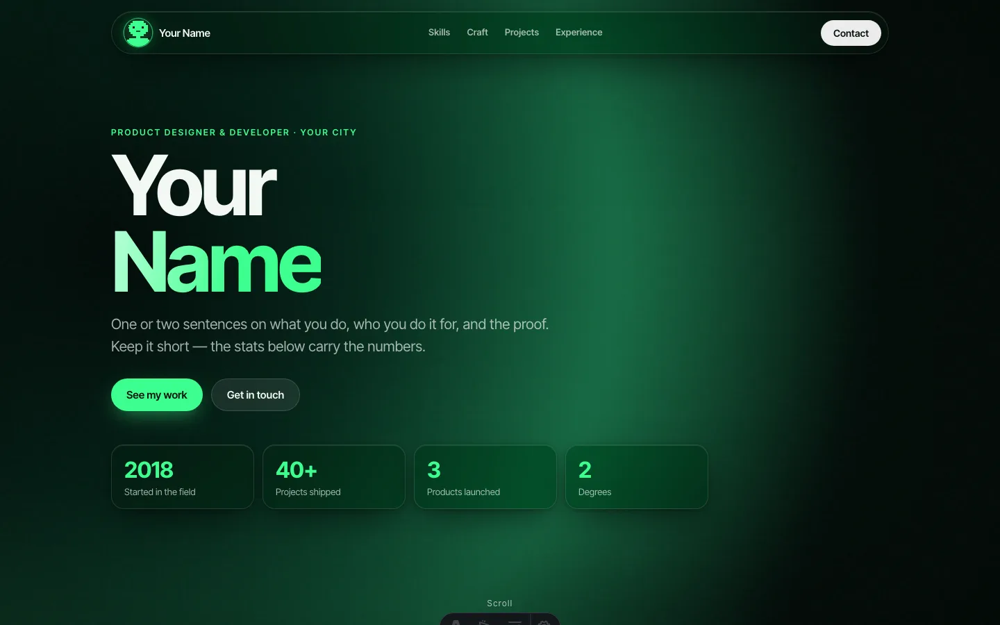
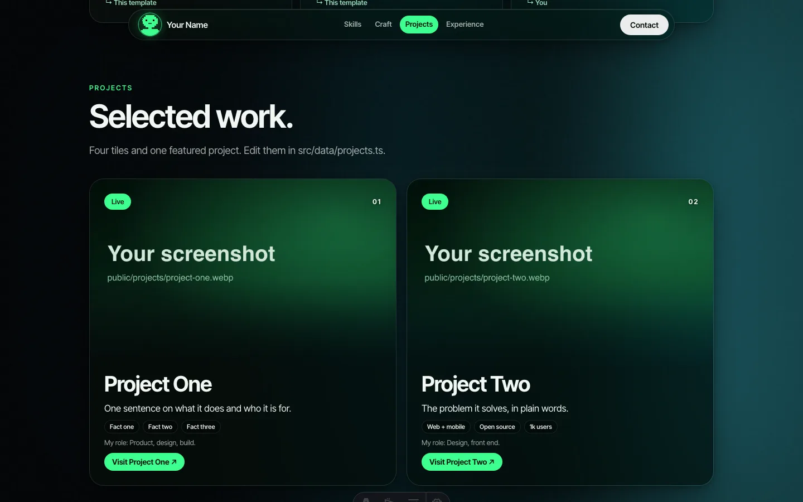
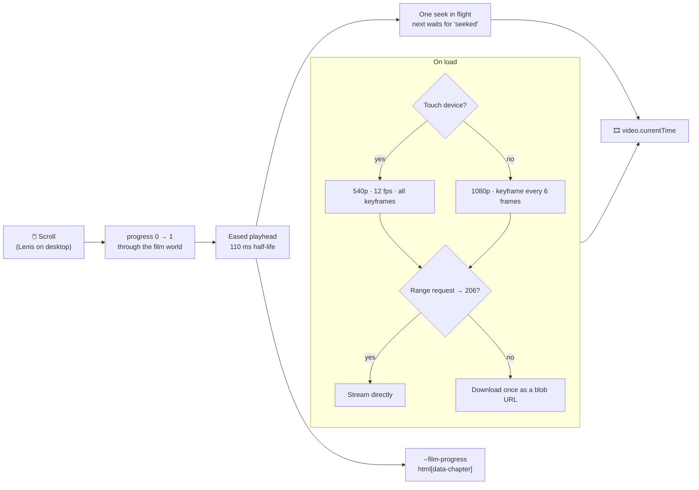

<div align="center">

# Astro Portfolio Template

### A fork-ready **Astro 7** portfolio where the whole page scrubs through a video as you scroll.

A cinematic, scroll-driven background film, floating frosted-glass header and
footer, 3D hover-tilt cards, and a drifting brand-logo marquee — on a fast,
static, accessible page. Edit four data files, drop in your clips, ship.

[](https://astro.build/)
[](https://www.typescriptlang.org/)
[](https://gsap.com/)
[](https://lenis.darkroom.engineering/)
[](https://playwright.dev/)
[](https://nodejs.org/)
[](./LICENSE)
[](#contributing)

**🔗 Live demo:** **[tejaskaranagrawal.com](https://tejaskaranagrawal.com/)** — a real portfolio running on this exact code.



</div>

---

## Table of contents

- [Why this template](#why-this-template)
- [Features](#features)
- [How the scroll film works](#how-the-scroll-film-works)
- [Tech stack](#tech-stack)
- [Quick start](#quick-start)
- [Make it yours](#make-it-yours)
- [Your own background film](#your-own-background-film)
- [Project structure](#project-structure)
- [Testing](#testing)
- [Deployment](#deployment)
- [Contributing](#contributing)
- [License](#license)

---

## Why this template

Scroll-driven video backgrounds look incredible on award sites — and are
painful to get right. Scrub a normal MP4 and it stutters, freezes on one
frame, or never plays on iPhone. This template ships the parts that are
actually hard: a film encoded for instant seeking, a playhead that glides
instead of jumping, a separate light encode for phones, a fallback for hosts
that don't support byte-range requests, and a page that stays fully readable
with JavaScript off or reduced motion on.

The content is plain HTML from four small data files, so recruiters, screen
readers, ATS parsers and search engines all see every word.

> This template ships neutral placeholder copy, a generated demo film and
> placeholder images for you to replace with your own.

---

## Features

| | |
|---|---|
| 🎞️ **Scroll-scrubbed film** | A fixed video behind the page; scroll position drives `currentTime`, eased so it glides |
| 📱 **Phone-aware** | Touch devices get a 540p, 12 fps all-keyframe encode that seeks instantly; iOS playback is primed on first touch |
| 🧊 **Floating glass UI** | Frosted header and footer pills with backdrop blur and a solid fallback where blur isn't supported |
| 🃏 **3D hover tilt** | Cards tilt toward the pointer with GSAP `quickTo` and a light that follows the cursor — desktop only, lazy-loaded |
| 🏷️ **Brand-logo marquee** | Two drifting rows of real logos rendered to inline SVG at build time — zero client JS |
| 🧭 **Section-aware nav** | Header links highlight the section in view; Lenis smooth scroll on desktop |
| ♿ **Accessible by default** | Real `<h1>`, landmarks, keyboard focus, `prefers-reduced-motion` keeps the poster and flat cards |
| 🔎 **SEO + JSON-LD** | Canonical, Open Graph/Twitter cards, Person + WebSite schema, sitemap, `robots.txt`, `llms.txt` |
| 📈 **Analytics as env** | GTM, GA4, Meta Pixel, TikTok, Plausible or Umami — each **off unless its env var is set** |
| 🧪 **Tested** | 19 Vitest unit tests for the scroll maths, 13 Playwright tests, Lighthouse budgets in CI |

<div align="center">

</div>

---

## How the scroll film works



- **Seekable encodes.** Ordinary MP4s have a keyframe every few seconds, so
  each seek decodes dozens of frames. The build script encodes with a keyframe
  every 6 frames (desktop) or every frame (touch).
- **Glide, don't jump.** The playhead eases toward the scroll target and only
  one seek is in flight at a time, so fast scrolling never queues a backlog.
- **Range fallback.** Seeking needs HTTP byte ranges. Some hosts (e.g. a
  Cloudflare `*.pages.dev` preview) answer `200` instead of `206`; the player
  detects this with a 2-byte probe and plays from a blob URL instead.
- **Chapters.** `film-chapters.json` records where each clip starts, published
  as `html[data-chapter]` so CSS can react to the part of the film on screen.

The pure maths lives in [`src/scripts/scroll-film-core.ts`](src/scripts/scroll-film-core.ts)
and is unit-tested; the DOM wiring is in [`src/scripts/scroll-film.ts`](src/scripts/scroll-film.ts).

---

## Tech stack

| Layer | Technology |
|---|---|
| Framework | Astro 7 (static output) · TypeScript 6 strict |
| Motion | GSAP 3 (hover tilt) · Lenis (smooth scroll) · native `<video>` scrubbing |
| Styling | Plain CSS with custom-property tokens · Inter Tight Variable (self-hosted) |
| Icons | `@iconify-json/logos` rendered at build time · SVG social icons as CSS masks |
| Media | ffmpeg (film encodes) · sharp (images) |
| Testing | Vitest · Playwright · Lighthouse CI |

---

## Quick start

**Prerequisites:** Node 22.12+ and npm. ffmpeg only if you rebuild the film.

```bash
# 1. Use this template on GitHub, or clone it
git clone https://github.com/floating-astronaut/astro-portfolio-template.git my-portfolio
cd my-portfolio

# 2. Install and run
npm install
npm run dev                    # http://localhost:4321
```

> 💡 The demo film is already in `public/media/film/`, so the site works
> immediately — no ffmpeg needed until you swap in your own clips.

---

## Make it yours

| To change… | Edit |
|---|---|
| Name, role, email, tagline, social links | [`src/lib/site.ts`](src/lib/site.ts) |
| Hero stats, experience, education, certifications | [`src/data/profile.ts`](src/data/profile.ts) |
| Project tiles (first four) and featured bar (fifth) | [`src/data/projects.ts`](src/data/projects.ts) + screenshots in `public/projects/` |
| The two groups of six capability cards | [`src/data/capabilities.ts`](src/data/capabilities.ts) |
| Section titles and order | [`src/pages/index.astro`](src/pages/index.astro) |
| Marquee logos | `rows` in [`src/components/LogoMarquee.astro`](src/components/LogoMarquee.astro) (any [`logos:` icon](https://icon-sets.iconify.design/logos/)) |
| Accent colour, glass, spacing | tokens at the top of [`src/styles/base.css`](src/styles/base.css) |
| How dark the film sits behind text | `--film-dim` in [`src/components/ScrollFilm.astro`](src/components/ScrollFilm.astro) |
| Avatar, favicons, OG image | `public/assets/brand/` (same file names) |
| Domain | `site` in [`astro.config.mjs`](astro.config.mjs) or `PUBLIC_SITE_URL`, plus `url` in `site.ts` and `robots.txt` |
| Analytics | `.env` — copy [`.env.example`](.env.example); every tracker is optional |

---

## Your own background film

Any 2+ clips work — AI-generated video (Veo, Sora, Runway…), stock footage or
screen recordings. 1920×1080 at 24 fps is ideal; abstract, slow-moving footage
reads best behind text.

```bash
# Joins your clips with 0.6 s crossfades and writes everything the site needs
bash media-src/build-film.sh clip1.mp4 clip2.mp4 clip3.mp4 clip4.mp4 clip5.mp4
```

This writes `public/media/film/` — the desktop and touch encodes, a poster
frame and the chapter map. The desktop encode steps its quality down until it
fits under Cloudflare Pages' 25 MiB file limit.

To regenerate the bundled demo film (ffmpeg only, no downloads):

```bash
npm run film:demo
```

---

## Project structure

```
.
├── src/
│   ├── components/
│   │   ├── ScrollFilm.astro       # fixed video + the "film world" that wraps the page
│   │   ├── FloatingHeader.astro   # glass pill nav, section highlighting
│   │   ├── FloatingFooter.astro   # glass footer: pages, projects, socials
│   │   ├── LogoMarquee.astro      # build-time SVG logo rows
│   │   └── sections/              # Hero, Capabilities, Projects, Experience, Contact
│   ├── data/                      # profile.ts · projects.ts · capabilities.ts
│   ├── lib/site.ts                # name, links, socials — edit first
│   ├── scripts/                   # scroll-film(-core), smooth-scroll, tilt
│   ├── styles/base.css            # tokens + glass + reveal
│   └── layouts/Base.astro         # head, SEO, JSON-LD, analytics
├── public/
│   ├── media/film/                # film encodes, poster, chapter map
│   ├── projects/                  # project screenshots
│   └── assets/brand/              # avatar, favicons, OG image
├── media-src/                     # build-film.sh · demo-clips.sh · placeholder-assets.mjs
├── tests/                         # unit/ (Vitest) · e2e/ (Playwright)
└── scripts/                       # JSON-LD validator · internal-link audit
```

---

## Testing

```bash
npm run test:unit                  # Vitest: scroll maths, easing, chapters, range fallback
npm run test:install               # once: Playwright's Chromium
npm test                           # Playwright: film scrubbing, touch encode, reduced motion,
                                   # header/footer, tilt, sections with JS off
npm run check                      # astro check (types)
```

The e2e tests read the same data files as the page, so they keep passing as
you replace the placeholder content. CI runs all of it plus a Lighthouse
budget (performance ≥ 0.85, accessibility ≥ 0.95) on every PR.

---

## Deployment

It builds to a plain static folder (`dist/`), so it deploys anywhere.

- **Cloudflare Pages** — build command `npm run build`, output `dist`, and set
  `PUBLIC_SITE_URL`. `public/_headers` already sets security headers and
  long-lived caching for assets.
- **Netlify / Vercel / GitHub Pages / nginx** — same build; serve `dist/`.

> ⚠️ Scrubbing needs the host to answer HTTP range requests with `206`. Most
> do; where one doesn't, the player falls back to downloading the film once,
> which still works but costs a slower first load.

---

## Contributing

Issues and PRs are welcome. Please keep `npm run check`, `npm run test:unit`
and `npm test` green. See [CONTRIBUTING.md](./CONTRIBUTING.md) for the full
guide and [SECURITY.md](./SECURITY.md) to report a vulnerability.

---

## License

[MIT](./LICENSE) © Tejas Karan Agrawal. Use it, fork it, ship your portfolio.

---

<div align="center">

*Built from a real, live portfolio and opened up as a starting point.*
**If it saved you time, a ⭐ is appreciated.**

</div>
